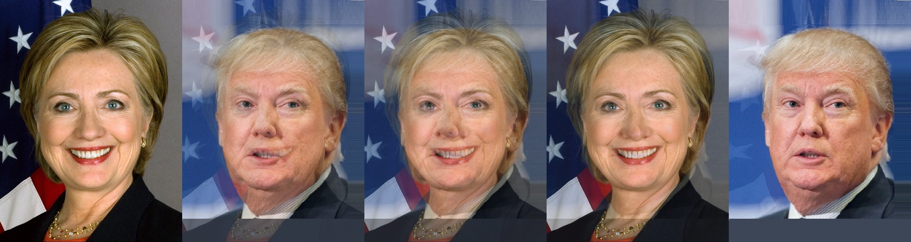
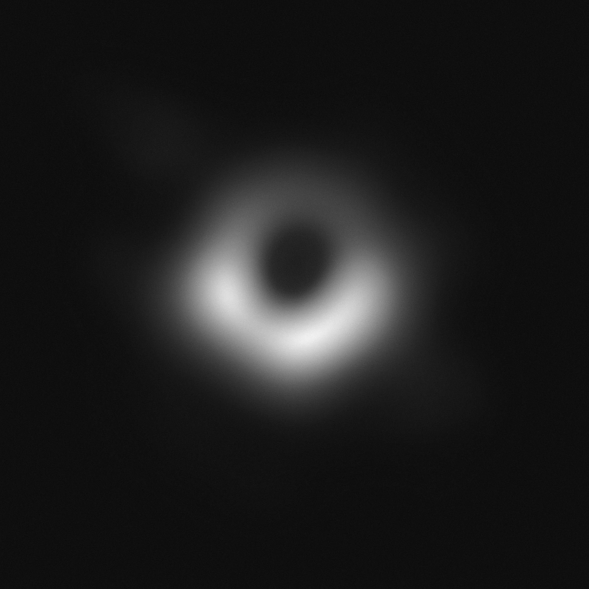
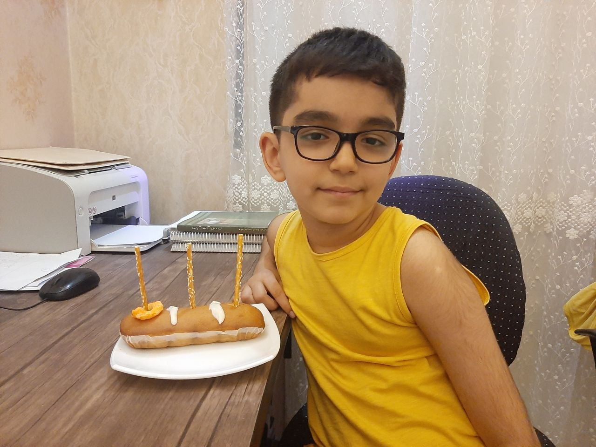
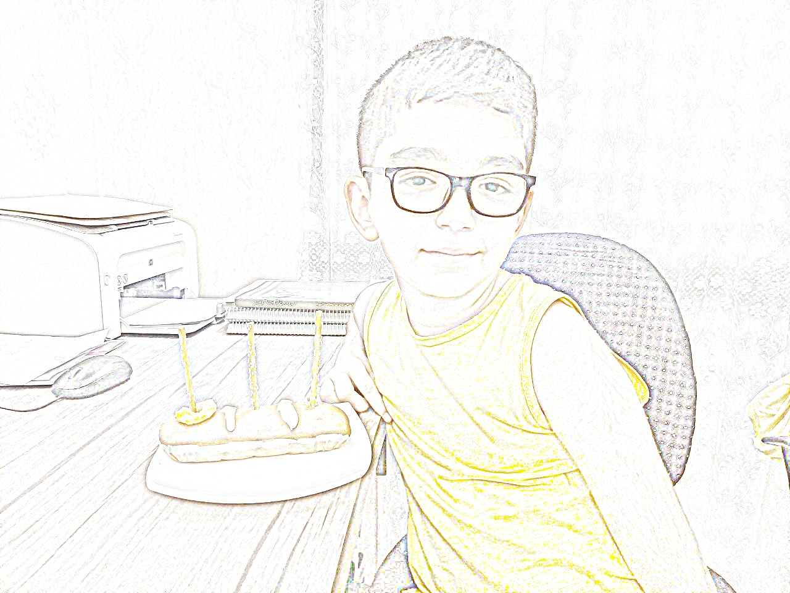
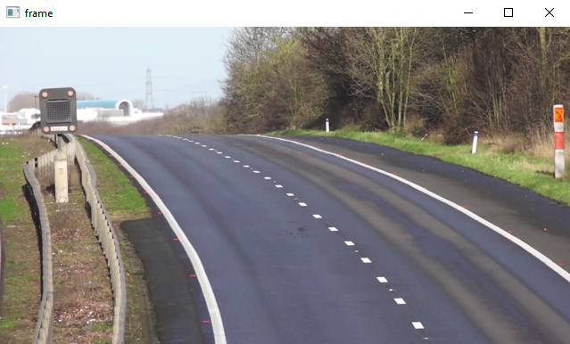
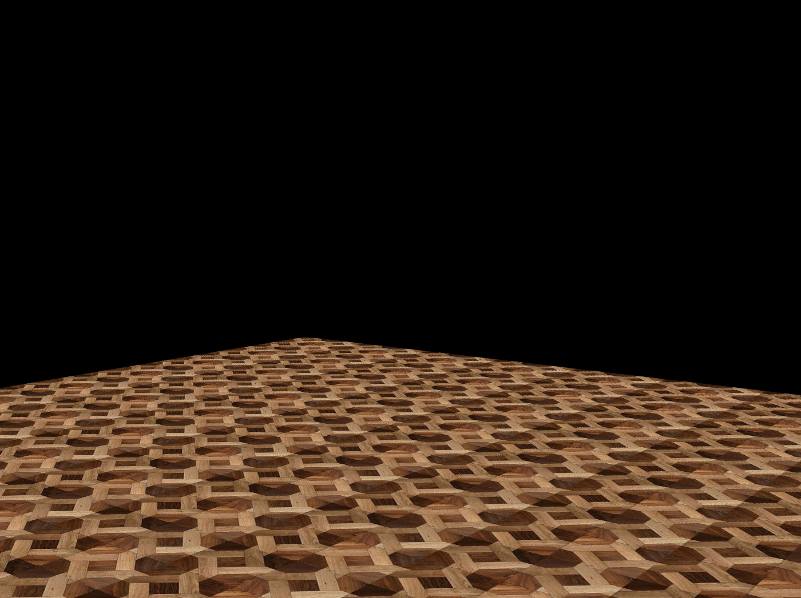

# Basic Math Operation
## 1. Face Morphing
Morph one face into another using [OpenCV](https://github.com/opencv/opencv)

## 2. Black Hole
using image processing and numpy to reduce noise in black hole images, then concatinate them together to make complete image.

## 3. Photo to Sketch
Using the division and GaussianBlur function, the image below is created

## 4. Find The Secret Text
subtract operation was used to find the secret text
  

## 5. Background Estimation
Calculated median of video frames to Make an image of empty road, without cars using scikit-image library 

 ## 6. Virtual Decoration
 Use mask to apply new floor in the room
 
 Floor Pattern:
 
 Mask:
 
 Result:
 
