# Convolution Basic Concepts
## 1. Calculate Histogram
Getting an image as input and calculate its **Histogram** then visualize the results with plt.plot(), plt.hist() and plt.bar() 
### input: 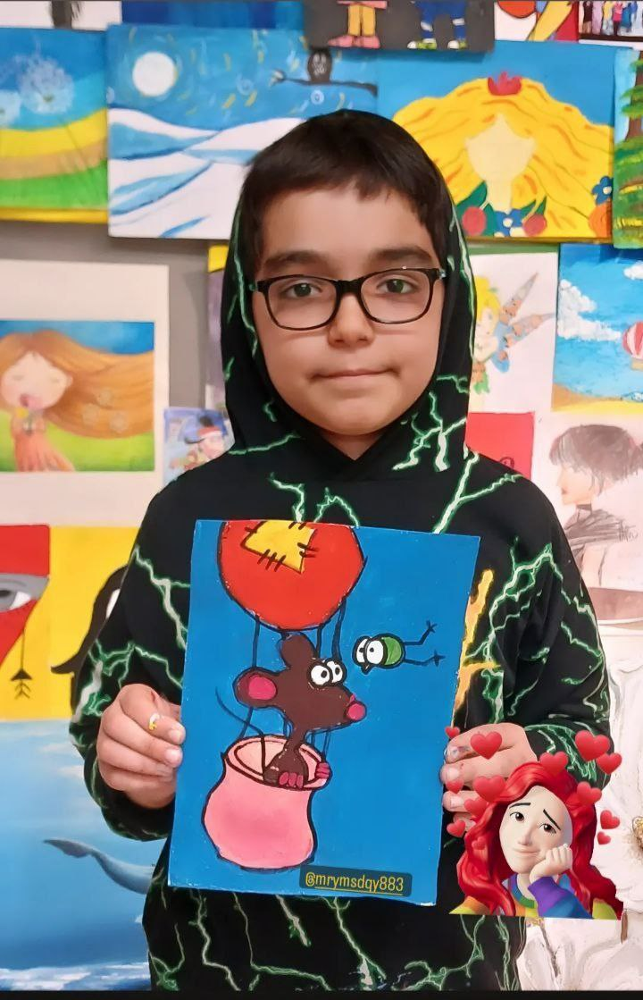

### output: plt.hist() 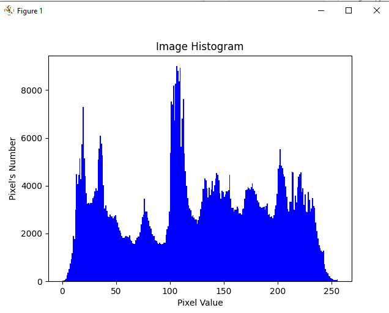
### output: plt.bar()  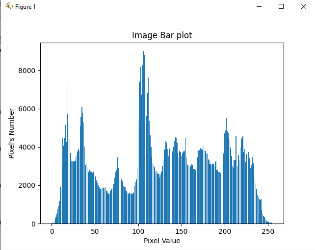
### output: plt.plot()  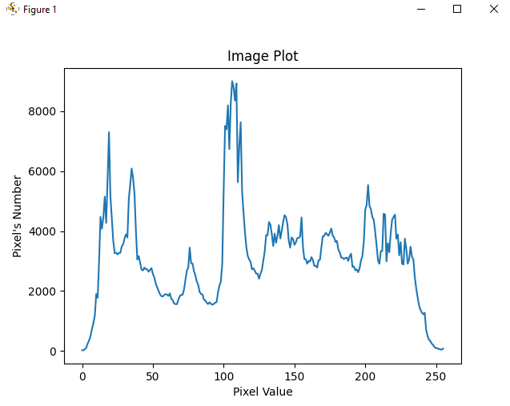

## 2. Forground focus and Blurred background
### input: 
### output: 
## 3. Edge Detection
Laplacian Operator is used to detect edges of image
### input:  

### output: 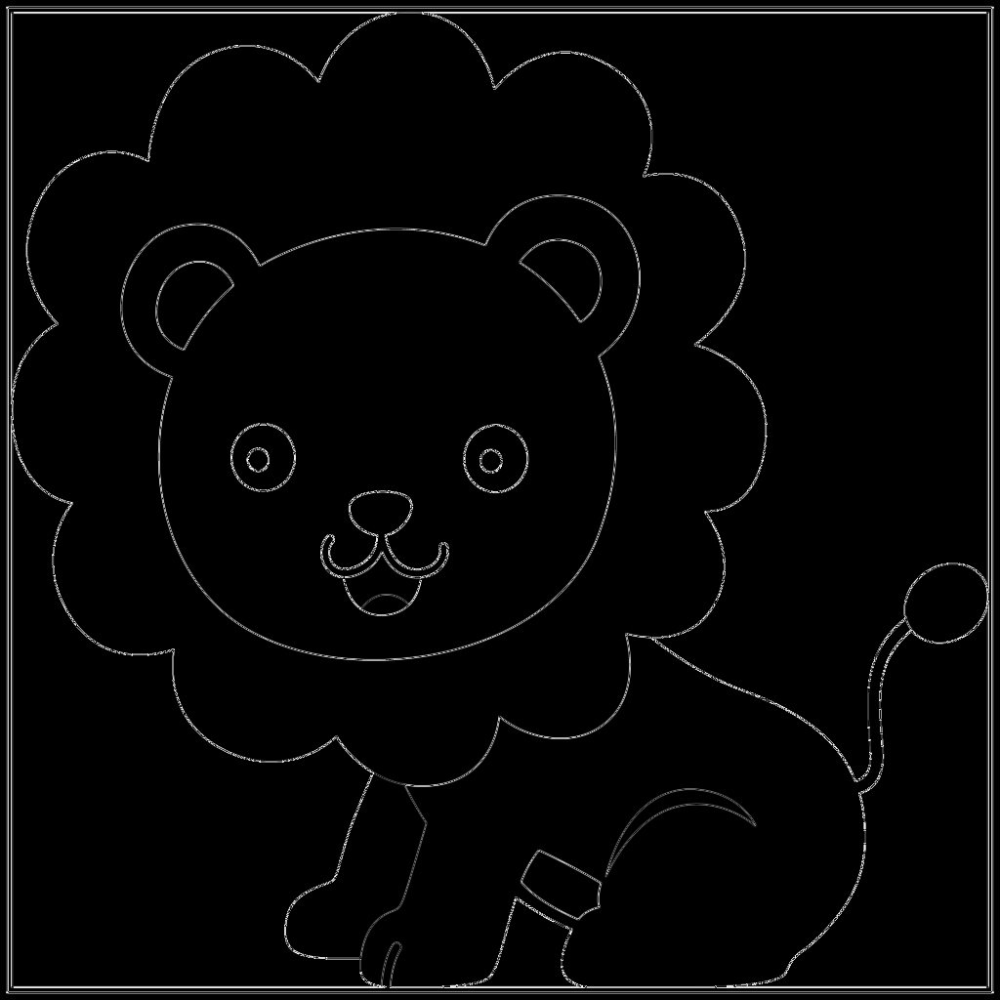  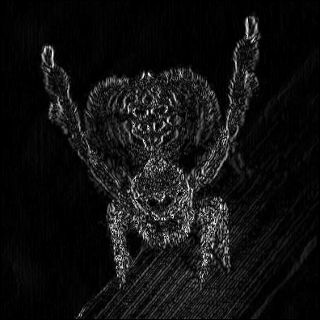

## 4. Building Horiontal & Vertical Edge Eetection
### input: 
### output:  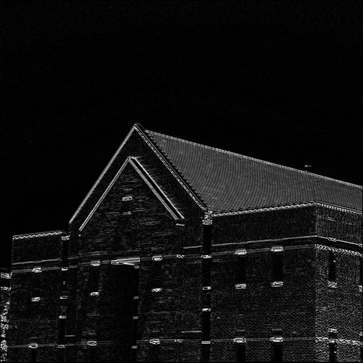  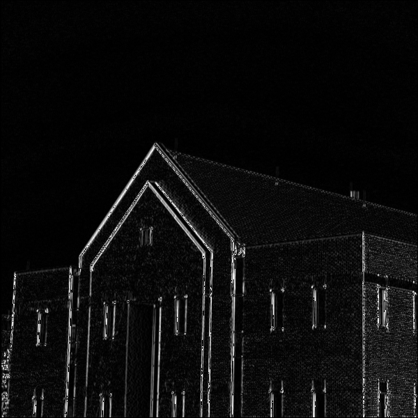

## 5. Image Noise Reduction
### input:   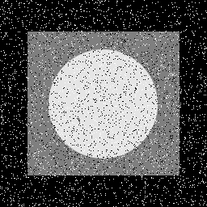
### output: 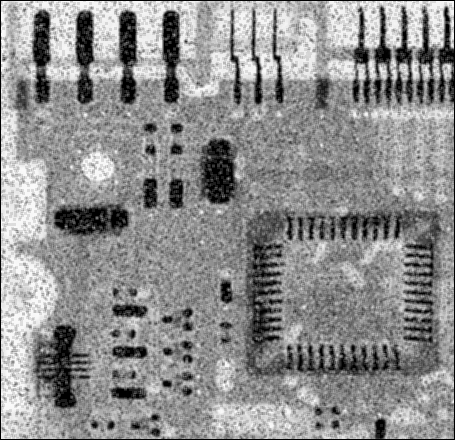  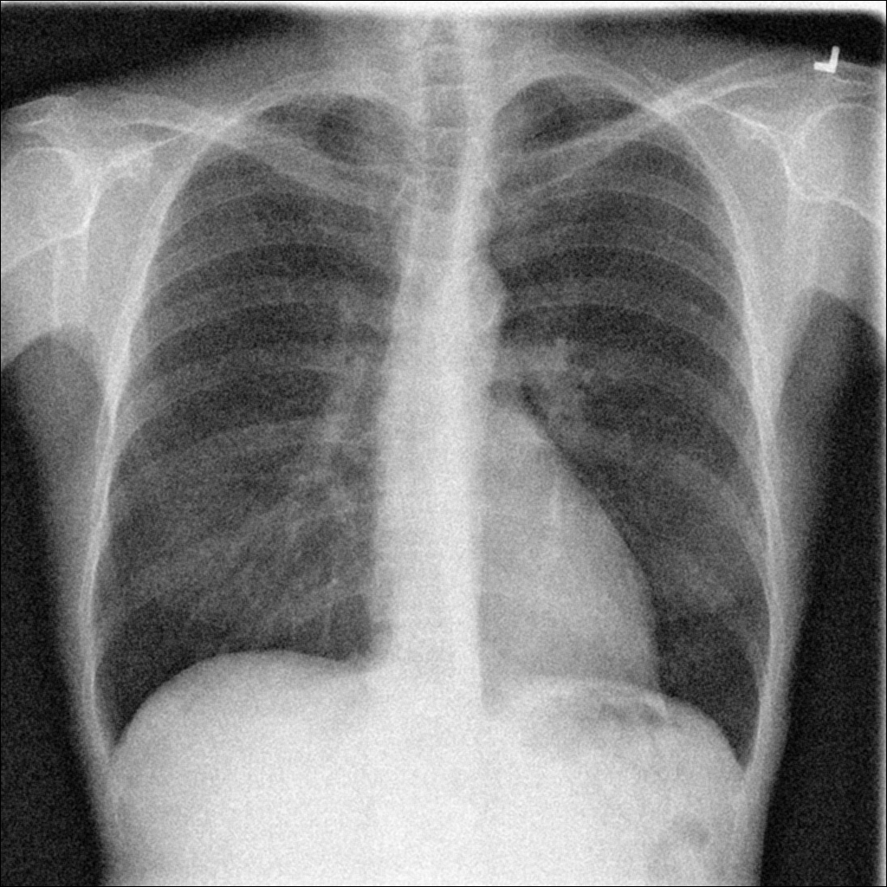
