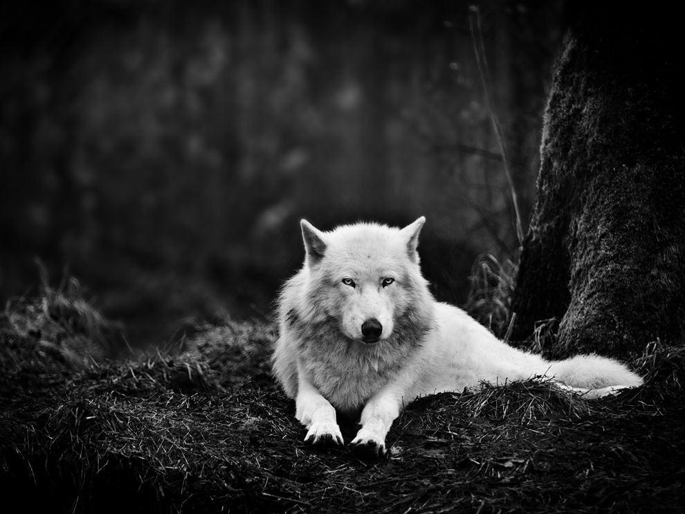
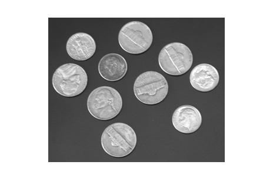
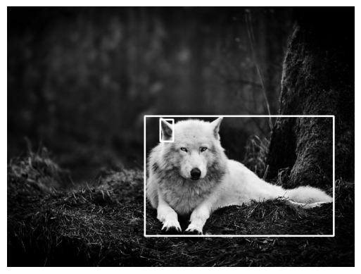
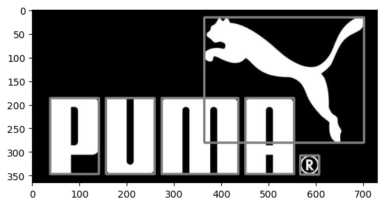
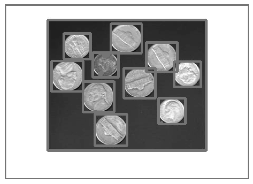
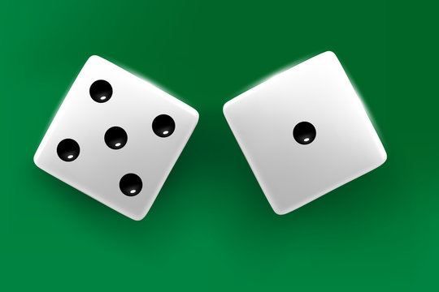

# Object Detection
## - Find Contour
### input:
     
### output:
    

## - Dice Recognition
a notebook was written for count the number of dots - that's the number on the dice.
### input: 
### output: 

## - Implementing 
- cv2.boundingRect() function from scratch.
- cv2.contourArea() function from scratch.
- cv2.findContours() function from scratch.

## - A funny webcam application
### input: 
### output: 