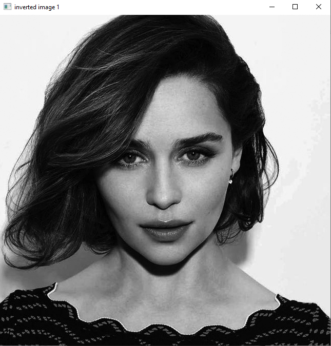
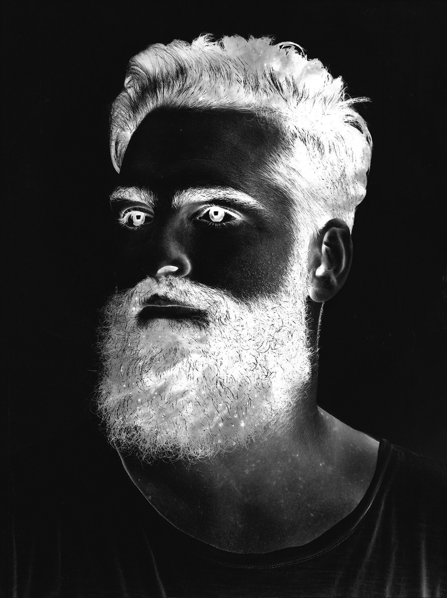
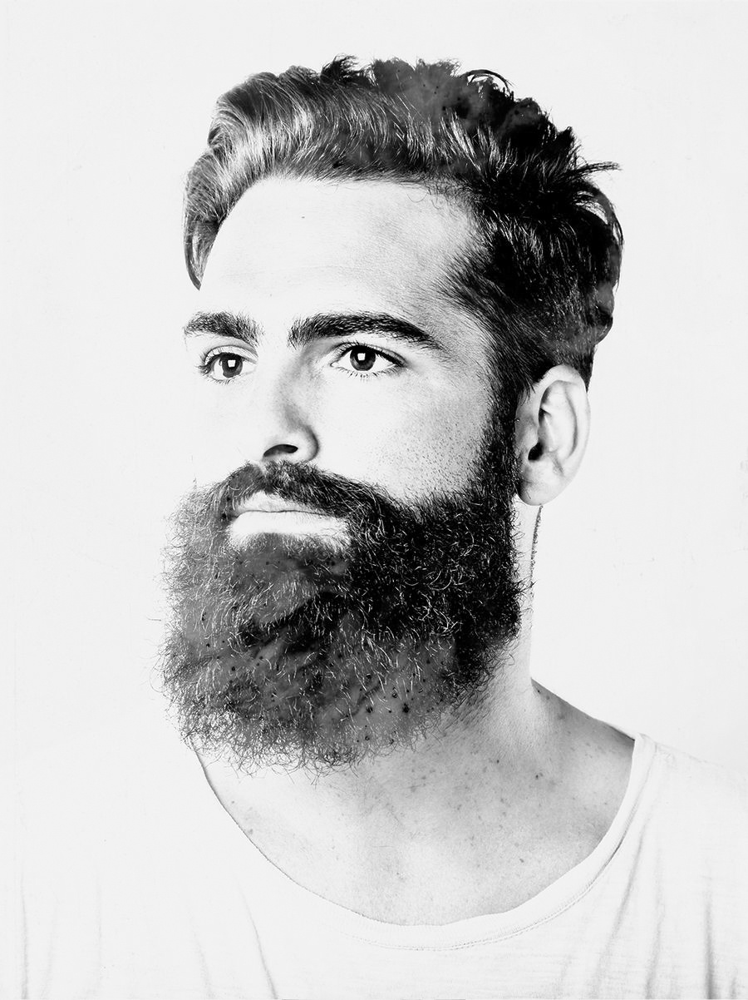

# 1. making a chessboard

 # 2. invert dark and light color
 
 

# 3. rotate image to 180 degree
 

# 4. design the first character of my name

# 5. Generate a gradient

# 6. add a black tape (death symbol) to an image
 